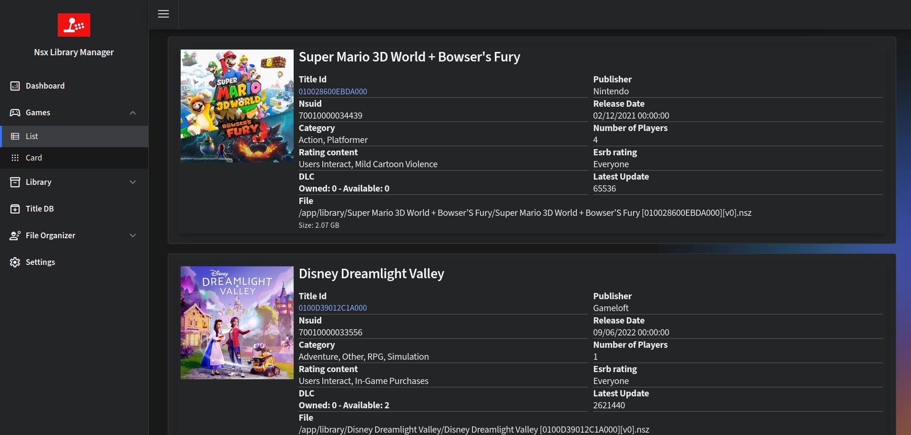
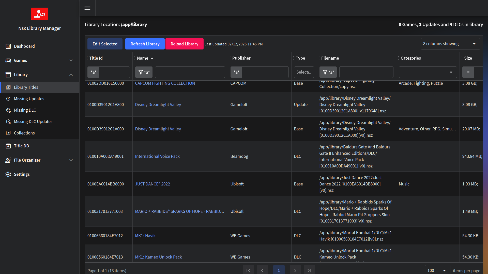
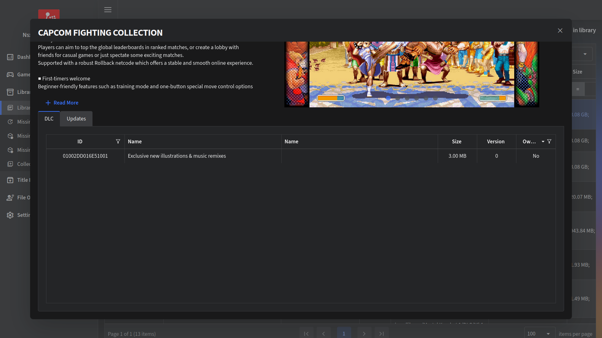
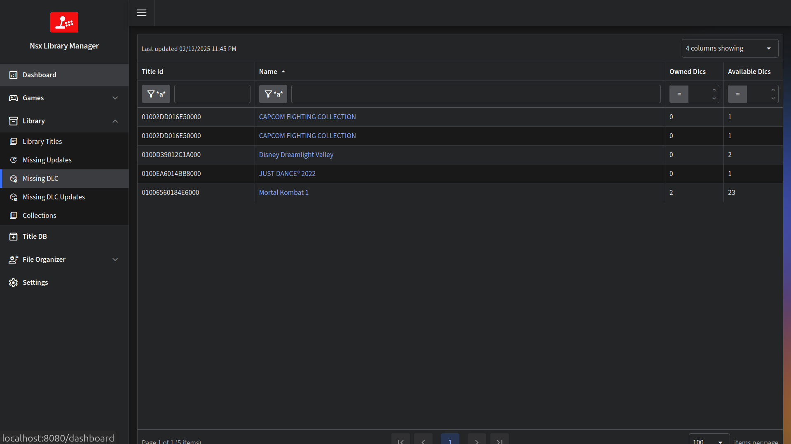
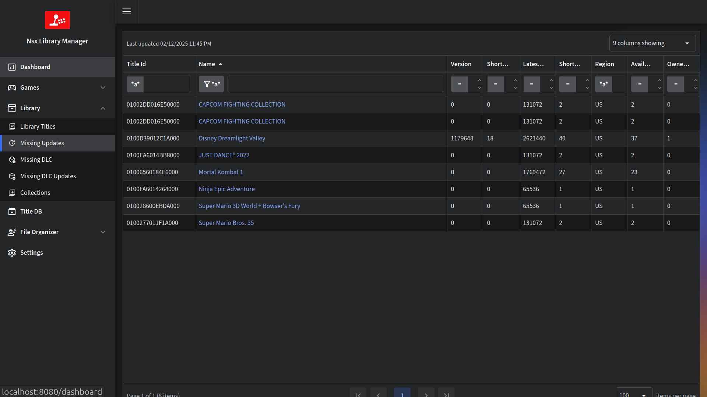

# Nsx Library Manager

## Description
This project helps to manage and visualize a nintendo switch library, organizing the files and creating a database with all the information.
I built this because I wanted to have a data grid that I could easily filter and sort my games,
that I could run on a server and access it from any device.

## Features
- Web interface.
- Runs on Windows, Linux and Mac.
- Supports NSP, NSZ, XCI, XCZ files.
- Read a folder and analyze all the files.
- Extract metadata from the files, like name, size, titleId, publisher and Icon.
- Use titledb to aggregate more information.
- Create a database with all the information.
- Shows a list or grid of all your games.
- Filter by name, publisher, size, titleId, region, type, etc.
- Sort by name, publisher, size, titleId, region, type, etc.
- List missing DLC or updates for your games.
- Local TitleDb, no need to download it every time.

## Requirements
- dotnet 8.0
- a recent browser (didn't worked on Edge 13)
- prod.keys

## Install
- Download the latest release
- Extract the zip/gz file
- Run the application
  - On Windows, run `NsxLibraryManager.exe`
  - On Linux, run `./NsxLibraryManager`
  - On Mac, run `./NsxLibraryManager`
- Open your browser and go to [http://localhost:5000](http://localhost:5000).
  - If you want to change the port, you need to define the host and port in `appsettings.json` or in the `ASPNETCORE_URLS ` Environment Variable. On `appsettings.json` add this section to listen on localhost port 5050:
    ```json
    "Kestrel": {
        "EndPoints": {
            "Http": {
                "Url": "http://localhost:5050"
            }
        }
    }
    ```
- On first run `titledb` will be downloaded, and the configuration screen will be shown first you need to set the paths to your library and prod.keys file.

> [!NOTE]  
> Please use absolute paths, relative paths might not work because the function to build paths is a little wonky for example `~/Library` will not work as expected on linux, as the final result will be `/ApplicationPath/~/Library` instead of `/home/user/Library`

## Docker
### GHCR
- To run the container from the ghcr registry you need to mount the library folder, for example:
  - `docker run --name nsxlibrarymanager -p 8080:8080 --mount type=bind,source=/home/ivan/roms/library,target=/app/library ghcr.io/ivaano/nsxlibrarymanager:latest` 
- additionally you can also mount the following optional folders:
  - renamer (used to put the files you want to rename that are not in the library) `--mount type=bind,source=/home/ivan/dumps,target=/app/renamer/in`
  - backup (used to move titles when removing duplicates) `--mount type=bind,source=/home/ivan/backup,target=/app/backup`
  - config (used to store app configuration) `--mount type=bind,source=/home/ivan/config,target=/app/config`
  - data (used to store app databases) `--mount type=bind,source=/home/ivan/data,target=/app/data`

### Manual
- Download the latest release source
- Extract the zip/gz file
- build the image `docker build -t nsxlibrarymanager .`
- you need to mount the library folder folder to the container, for example mounting only the library folder:
  -`docker run --name nsxlibrarymanager -p 8080:8080 --mount type=bind,source=/home/ivan/library,target=/app/library nsxlibrarymanager:latest`
- additionally you can also mount the following optional folders:
  - renamer (used to put the files you want to rename that are not in the library) `--mount type=bind,source=/home/ivan/dumps,target=/app/renamer/in`
  - backup (used to move titles when removing duplicates) `--mount type=bind,source=/home/ivan/backup,target=/app/backup`
  - config (used to store app configuration) `--mount type=bind,source=/home/ivan/config,target=/app/config`
  - data (used to store app databases) `--mount type=bind,source=/home/ivan/data,target=/app/data`

 ## Usage
- Games
  - List
    - Used to quickly find a game in your library, you can see the name, publisher, size, titleId and the Icon image. 
  - Card
    - This is a compact list of the games in your library showing only the icon image, so you can browse through your library.
> [!TIP]
> You can filter by Name or TitleId.
- Library
  - Library Titles
    - This is a list of all the titles in your library, its purpose is to show you all the files you have in your library, you can sort and filter by any field.
    - Edit Selected
      - This will allow you to edit the selected titles, you can add them to a collection, or remove them from a collection.
    - Refresh Library
      - This will search for files added or removed from the library and update the database.
    - Reload Library
      - This will clear the database and reanalyze all the files in your library.
> [!CAUTION]
> Reload Library will remove all the information in the database, including collections.
  - Missing Updates
    - This will show you all the games that don't have the latest update, as well as how many updates the title has. 
  - Missing DLC
    - This will show you all the games that have missing DLC.
  - Missing DLC Updates
    - This will show you all the games that have missing DLC updates.
  - Collections
    - Here you can view and create collections, to add games to a collection you need to do it on the library titles grid by selecting the games you want to add to a collection and clicking on edit selected, alternatively you can add use the edit button on each title row to add the title to a collection, when a title is added to a collection all related titles will be added too.
> [!TIP]
> the changes made to library titles grid, like column size columns shown. filters and sorting are saved to your browser local storage so you don't need to set them every time.
- TitleDb
  - This is a local copy of the titledb, you can search for a titleId and see all the information related to that titleId.
- File Organizer
  - Renamers: This are independant renamers that don't need any information from your library, they will rename the files based on file metadata and titledb information.
    - By Package Type
      - Useful to rename by content type (base, update, dlc). (all base in one folder, all updates in another, etc)
    - By Bundle Type
      - Useful to rename by titleId, grouping all related titles in one folder.
  - Library: 
    - Collection Renamer
      - This organizes the files in your library based on the collection they are in.
    - Duplicate Titles
      - Find all the duplicate titles in your library.


## Screenshots










## TODO
- [x] Implement the file organizer.
- [x] Support more Regions.
- [x] Ability to add custom information to each title (favorite, rating).
- [ ] Ability to download and store banners and screenshots locally.
- [ ] Optimization.


## Credits
- [Libhac](https://github.com/Thealexbarney/LibHac) For the amazing library to read nintendo switch files.
- [Titledb](https://github.com/blawar/titledb) For the excellent database with all the information.
- [LiteDb](https://www.litedb.org) 
- [Radzen.Blazor](https://github.com/radzenhq/radzen-blazor)
