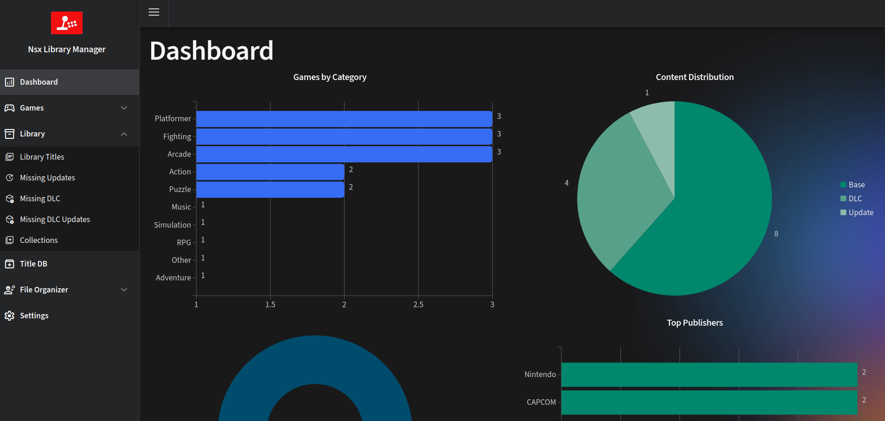

# Nsx Library Manager

## Description
This project helps to manage and visualize a nintendo switch library, organizing the files and creating a database with all the information.
I built this because I wanted to have a data grid that I could easily filter and sort my games,
that I could run on a server and access it from any device.

## Features
- Web interface.
- Runs on Windows, Linux and Mac.
- Supports NSP, NSZ, XCI, XCZ files.
- Read a folder and analyze all the files.
- Extract metadata from the files, like name, size, titleId, publisher and Icon.
- Use titledb to aggregate more information.
- Create a database with all the information.
- Shows a list or grid of all your games.
- Filter by name, publisher, size, titleId, region, type, etc.
- Sort by name, publisher, size, titleId, region, type, etc.
- List missing DLC or updates for your games.
- Local TitleDb, no need to download it every time.

## Requirements
- dotnet 8.0
- a recent browser (didn't worked on Edge 13)
- prod.keys

## Install
- Download the latest release
- Extract the zip/gz file
- Create `titledb\config.json` and customize it to your needs:
  - `TitleDatabase`: Path where the db file is going to be stored, this is required and must end with `.db`. **Use a fast drive for this file, like a NVMe**.
  - `LibraryPath`: Path to your library.
  - `Recursive`: If true, it will search recursively in the library path.
  - `TitleDbPath`: Path where we are going to download titledb json Files to add them to the db.
  - `RegionUrl`: Url to download the region file.
  - `CnmtsUrl`: Url to download the cnmts file.
  - `VersionUrl`: Url to download the version file.
  - `Regions`: List of regions to download.
  - `ProdKeys`: Path to your prod.keys file, if this value is not set, program will look in the same folder as the executable, or you can put them in `$HOME/.switch/prod.keys`.
- Alternative to creating the file manually, run the application once and it will create a default config file you can use the the browser to edit it.

> [!WARNING]
> Be sure that the paths you put on `config.json` are valid, the application doesn't create the paths if they don't exists.

> [!NOTE]  
> Please use absolute paths, relative paths might not work because the function to build paths is a little wonky for example `~/Library` will not work as expected on linux, as the final result will be `/ApplicationPath/~/Library` instead of `/home/user/Library`

## Docker
### GHCR
- you can mount the keys, titledb and library folders to the container, for example:
  -`docker run 'ghcr.io/ivaano/nsxlibrarymanager:master' -p 8080:8080 --mount type=bind,source=/home/ivan/nsxlib/keys,target=/app/keys --mount type=bind,source=/home/ivan/nsxlib/library,target=/app/library nsxlibrarymanager`

### Manual
- Download the latest release
- Extract the zip/gz file
- build the image `docker build -t nsxlibrarymanager .`
- you can mount the keys, titledb and library folders to the container, for example:
  -`docker run --name nsxlibrarymanager -p 8080:8080 --mount type=bind,source=/home/ivan/nsxlib/keys,target=/app/keys --mount type=bind,source=/home/ivan/nsxlib/library,target=/app/library nsxlibrarymanager`

 ## Usage
- Run the `NsxLibraryManager.exe` file.
- If you are running it for the first time, you will need to download the region, cnmts and version files.
- Open your browser and go to [http://localhost:5000](http://localhost:5000).
- On first run you will need to update titledb, go to Titledb and click on **Update Titledb** button.
- After that, go to Library and click on **Reload Library**
- If new files are added to your library, you can use the **Refresh Library** button to update the database.
- Reload Library will drop the table and create it again.

> [!TIP]
> To setup the port or the listening address, you can use the `--urls` parameter, for example `./NsxLibraryManager.exe --urls http://*:6666` will listen on any interface on port 6666.

## Screenshots

## TODO
- [x] Implement the file organizer.
- [ ] Support more Regions.
- [ ] Ability to add custom information to each title (favorite, rating).
- [ ] Ability to download and store banners and screenshots locally.
- [ ] Optimization.

## Credits
- [Libhac](https://github.com/Thealexbarney/LibHac) For the amazing library to read nintendo switch files.
- [Titledb](https://github.com/blawar/titledb) For the excellent database with all the information.
- [LiteDb](https://www.litedb.org) 
- [Radzen.Blazor](https://github.com/radzenhq/radzen-blazor)
